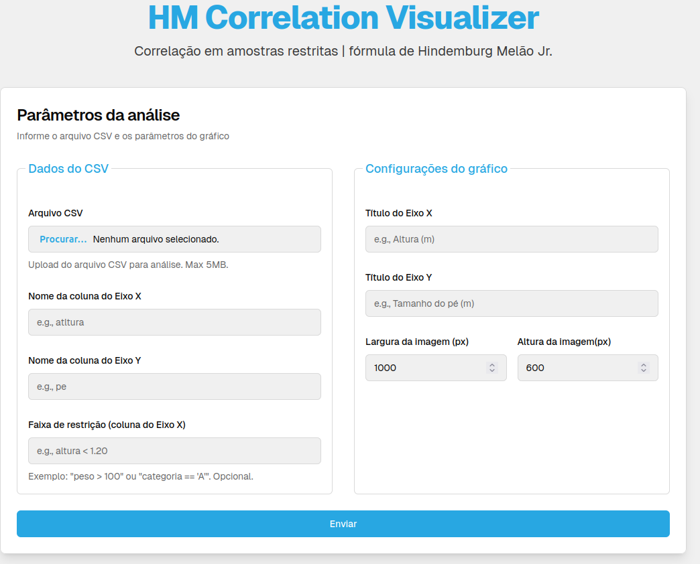

# HM Correlation Visualizer

[](https://nextjs.org/)
[](https://www.typescriptlang.org/)
[](https://tailwindcss.com/)
[](https://docs.docker.com/)

Cliente para visualização de correlações corrigidas pelo Método Hindemburg.



## 📋 Sobre o Projeto

Esta aplicação oferece uma interface amigável para o serviço [Ajuste de Correlação Hindemburg](https://github.com/halissontorres/ajuste-correlacao-hindemburg), que implementa a fórmula proposta por **Hindemburg Melão Jr.** para corrigir correlações estatísticas com restrição de faixa.

## 💡 Tecnologias empregadas

- NextJS (Framework React)
- TypeScript
- Tailwind CSS
- Docker

### Funcionalidades

- ✅ Upload de arquivos CSV (até 5MB)
- ✅ Seleção de colunas X e Y para análise
- ✅ Aplicação opcional de filtros por faixa
- ✅ Personalização de rótulos e dimensões do gráfico
- ✅ Visualização em tempo real dos resultados

## 🔍 Método de Correção HM

O método implementa um ajuste matemático para correlações de Pearson em conjuntos de dados com restrição de faixa, proporcionando uma medida mais precisa da correlação real entre variáveis.

> **Saiba mais:** Para entender a base teórica e acessar a API REST por trás deste projeto, visite o [repositório do serviço principal](https://github.com/halissontorres/ajuste-correlacao-hindemburg).

## 🚀 Como Usar

### Pré-requisitos

- [Node.js](https://nodejs.org/) (versão recomendada: LTS)
- [Docker](https://www.docker.com/) (opcional, para implantação em contêiner)

### Instalação

#### Opção 1: Desenvolvimento Local

Clone o repositório e instale as dependências:

```bash
# Clone este repositório
git clone https://github.com/halissontorres/hm-correlation-visualizer.git
cd hm-correlation-visualizer

# Instale as dependências
npm install
# ou
yarn install
```

#### Opção 2: Usando Docker

O projeto inclui configurações Docker para facilitar a implantação em diferentes ambientes:

```bash
# Produção
docker-compose up app

# Desenvolvimento com hot-reload
docker-compose up app-dev
```

### Execução

```bash
# Inicie o servidor de desenvolvimento local
npm start
# ou
yarn start
```

A aplicação estará disponível em [`http://localhost:9002`](http://localhost:9002)

## 🔧 Configuração Docker

O projeto possui configurações Docker para ambientes de produção e desenvolvimento:

### Estrutura Docker

#### Dockerfile Multi-estágio
O projeto utiliza um `Dockerfile` multi-estágio para otimizar o tamanho da imagem final:

1. **Base**: Imagem Node.js Alpine para ambiente leve
2. **Dependencies**: Instala apenas as dependências necessárias
3. **Builder**: Compila a aplicação Next.js com modo `standalone`
4. **Runner**: Imagem final, contendo apenas arquivos essenciais para produção

```dockerfile
# Resumo do Dockerfile
FROM node:20-alpine AS base
# ... configurações de base

FROM base AS deps
# ... instalação de dependências

FROM base AS builder
# ... build da aplicação Next.js

FROM node:20-alpine AS runner
# ... configuração final para produção com usuário não-root
```

#### Docker Compose
O arquivo `docker-compose.yml` define dois serviços:

1. **app**: Ambiente de produção otimizado
   ```yaml
   # Produção
   docker-compose up app
   ```

2. **app-dev**: Ambiente de desenvolvimento com hot-reloading
   ```yaml
   # Desenvolvimento
   docker-compose up app-dev
   ```

### Variáveis de Ambiente

As configurações Docker suportam a seguinte variável de ambiente principal:

| Variável                   | Descrição             | Valor Padrão                                                                                  |
|----------------------------|-----------------------|-----------------------------------------------------------------------------------------------|
| `NEXT_PUBLIC_API_ENDPOINT` | URL do serviço de API | `http://127.0.0.1:5000` |

Você pode sobrescrever esta variável de três maneiras:
- No arquivo `.env` local
- Na linha de comando ao executar `docker-compose`
- Nas definições de ambiente do seu sistema de orquestração

### Exemplo de Uso com Docker

```bash
# Executar com API personalizada
NEXT_PUBLIC_API_ENDPOINT=http://127.0.0.1:5000 docker-compose up app

# Construir imagem com endpoints personalizados
docker-compose build --build-arg NEXT_PUBLIC_API_ENDPOINT=http://127.0.0.1:5000
```

> **Nota**: A aplicação é configurada para executar na porta 9002 por padrão, tanto localmente quanto nos contêineres Docker.

## 🔌 Integração com API

Esta interface consome o serviço REST disponível em:

[github.com/halissontorres/ajuste-correlacao-hindemburg](https://github.com/halissontorres/ajuste-correlacao-hindemburg)

O fluxo de funcionamento é:
1. Upload do arquivo CSV pela interface
2. Configuração dos parâmetros
3. Processamento pelo serviço REST
4. Retorno e exibição do gráfico de correlação (formato PNG)

Por padrão, a aplicação está configurada para usar o endpoint:
```
http://127.0.0.1:5000
```

Para usar um servidor API diferente, configure a variável de ambiente `NEXT_PUBLIC_API_ENDPOINT`.

## 📄 Licença

Este projeto está licenciado sob os termos da licença MIT. Veja o arquivo [LICENSE](LICENSE) para mais detalhes.

---

_Desenvolvido para fins educacionais, científicos e aplicação prática da correção de correlação com restrição de faixa (método HM)._